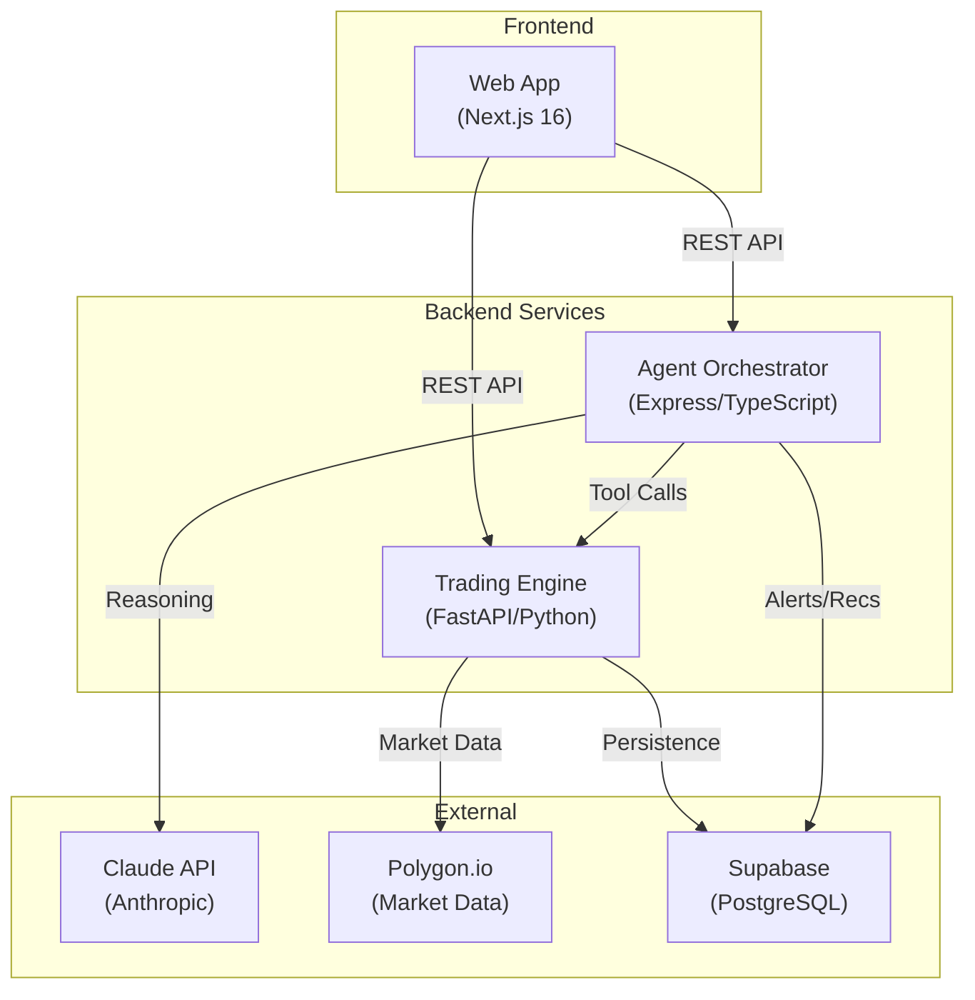

# Sentinel Trading Platform — Architecture

## System Overview

Sentinel is a monorepo trading platform with three core services:

## Services

### Web App (`apps/web`)
- **Framework**: Next.js 16 with React 19
- **Styling**: Tailwind CSS with dark theme
- **State**: Zustand for client state
- **Routing**: App Router with server/client components
- **Key Features**: Dashboard, portfolio, signals, strategies, backtesting, settings

### Trading Engine (`apps/engine`)
- **Framework**: FastAPI with async Python
- **Data Source**: Polygon.io for market data (OHLCV, quotes)
- **Strategies**: Pluggable strategy framework with momentum, mean reversion, trend, volatility, gap, volume families
- **Risk Management**: Position sizing, drawdown circuit breakers, concentration limits
- **Storage**: Supabase PostgreSQL via PostgREST

### Agent Orchestrator (`apps/agents`)
- **Framework**: Express with TypeScript
- **AI**: Anthropic Claude with tool-calling pattern
- **Agents**: Market Sentinel, Strategy Analyst, Risk Monitor
- **Cycle**: Sequential execution every 15 minutes during market hours
- **Validation**: Zod schemas on all tool inputs

### Shared Types (`packages/shared`)
- TypeScript type definitions shared across web and agents
- Strategy, OHLCV, signal, and portfolio types

## Data Flow

### Trading Cycle
1. **Orchestrator** triggers sequential agent cycle
2. **Market Sentinel** calls engine for quotes → assesses conditions → creates alerts
3. **Strategy Analyst** calls engine for strategy scans → evaluates signals → creates recommendations
4. **Risk Monitor** calls engine for portfolio state → checks limits → approves/rejects trades

### User Request Flow
1. **Browser** → Next.js server component / API route
2. **Next.js** → Service proxy (with retry + timeout) → Engine/Agents
3. **Response** → Server-side rendered or client-side updated

## Infrastructure

### Docker
- Multi-stage builds for engine and agents
- Non-root `sentinel` user
- Health checks on all services
- `docker-compose.yml` for local development

### CI/CD
- GitHub Actions: lint, test (with coverage), type check, build, Docker build
- CodeQL security scanning (JS/TS + Python)
- Dependency audit (npm + pip)

### Security
- API key authentication on engine endpoints
- Rate limiting on agents API (60 req/min)
- Input validation with Zod (agents) and Pydantic (engine)
- Non-root Docker containers
- Dependency auditing in CI
